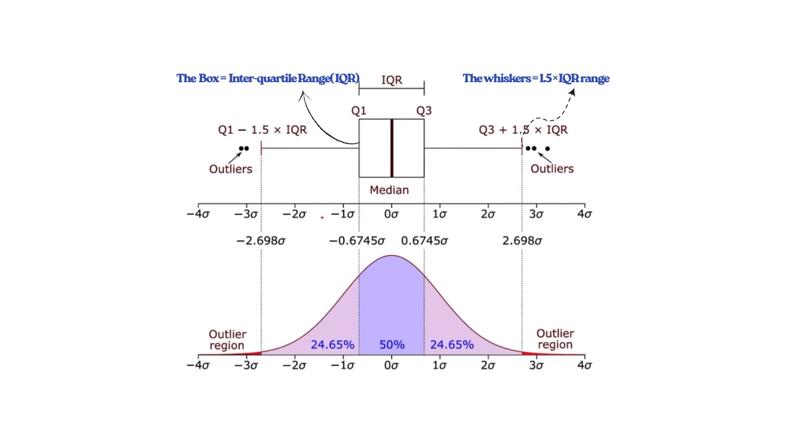

# Median vs. Mean: Understanding the Impact of Outliers and Skewness

- The **median** is a better measure of central tendency for skewed data because it is unaffected by extreme outliers, while the **mean** is heavily influenced by them. 
- In a skewed distribution, extreme values "pull" the mean in the direction of the skew, making it a misleading representation of the data's center. 
- The **median**, on the other hand, represents the middle value after the data is ordered, making it more reliable for describing the typical value.

## 🔹 Mean vs. Median and Outliers

- #### **Mean is sensitive to outliers:**  
  The mean is calculated by summing all values and dividing by their count. A single extreme value (very high or very low) can significantly change the mean.

- #### **Median is robust to outliers:**  
  The median depends only on the middle position of the data and not on extreme values, so it remains stable even when outliers are present.

## 🔹 Outliers and Their Effects on Data

#### **Outliers** are values that deviate significantly from most other data points. They can arise from measurement errors, natural variability, or data entry mistakes.

### **Effects of Outliers:**
1. Distort the **mean**, making it less representative of the dataset.
2. Increase the **standard deviation**, exaggerating variability.
3. Affect **correlation** and **regression** results, leading to unreliable models.

When outliers exist, the **median** (and **IQR**) are preferred over the **mean** (and **standard deviation**) for summarizing data.

## 🔹 Types of Skewness

#### **Skewness** measures asymmetry in a distribution.

1. **Positively Skewed (Right-Skewed) Distribution:**  
   - Tail extends to the right.  
   - Outliers have **high values**.  
   - **Mean > Median > Mode**.  
   - Example: Income data.

2. **Negatively Skewed (Left-Skewed) Distribution:**  
   - Tail extends to the left.  
   - Outliers have **low values**.  
   - **Mean < Median < Mode**.  
   - Example: Age at retirement.

3. **Symmetrical (Zero Skew) Distribution:**  
   - Both tails are equal.  
   - **Mean = Median = Mode**.  
   - Example: Human height distribution.

## 🔹 Connection Between Outliers, Skewness, and Central Tendency

Outliers are often responsible for **skewness** in data.  
- In **right-skewed data**, high-value outliers pull the mean to the right.  
- In **left-skewed data**, low-value outliers pull the mean to the left.  

The **median** stays stable because it relies only on data order, not magnitude.  
Thus, in skewed or outlier-affected datasets, the **median** is the most reliable indicator of the data’s true center.
